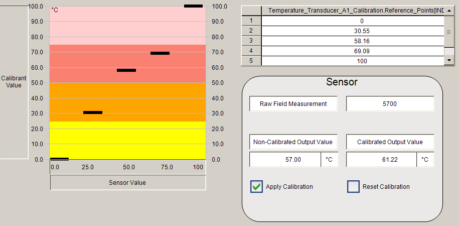

# 🛠️ Sensor Calibration - TwinCAT 3

This project is part of my **Control & Instrumentation Engineering Portfolio** and demonstrates a **Sensor Calibration System** using TwinCAT 3.1.

It simulates a real-world use case where analog sensor inputs (e.g. a PT100 temperature probe) require calibration to ensure accurate and reliable engineering unit outputs.

---

## 📌 Project Summary

This TwinCAT 3.1 project includes:

- ✅ **Scaling Function Block** for a PT100 sensor connected via a Beckhoff EL3202 RTD input card.
- ✅ **Calibration Function Block** that supports **multi-point calibration** using linear interpolation.
- ✅ An interactive **SCADA-style visualization** with trend data and calibration options.
- ✅ Data entry table for modifying reference points live during runtime.
- ✅ Option to apply or reset calibration via checkboxes.

---

## ⚙️ Key Features

- **Multi-Point Calibration**:
  - Uses two arrays:
    - `SensorPoints` – The actual measured input values.
    - `ReferencePoints` – The true/desired values (from a calibrator).
  - Applies **linear interpolation** between these points.

- **Live Readings**:
  - Shows both *non-calibrated* and *calibrated* output values for comparison.
  
- **Visualization**:
  - A heatmap-style calibration graph.
  - Text boxes and a clean layout to demonstrate calibration effects in real-time.

---

## 🖼️ System Demonstration

Here is a screengrab of the system in action:

---

## 📂 Project Repository

You can explore the project files and code in the repo:

🔗 **[Sensor-Calibration on GitHub](https://github.com/Yasteer/Sensor-Calibration.git)**

---

## 📈 Future Improvements

- Add logging functionality for calibration sessions.
- Support for other sensor types like 4–20 mA pressure transducers.
- Improved interpolation algorithms (e.g. polynomial or piecewise linear).

---

## 👷‍♂️ About the Developer

This project was developed as part of a professional engineering portfolio in the field of **Electrical, Control, and Instrumentation Engineering**.
